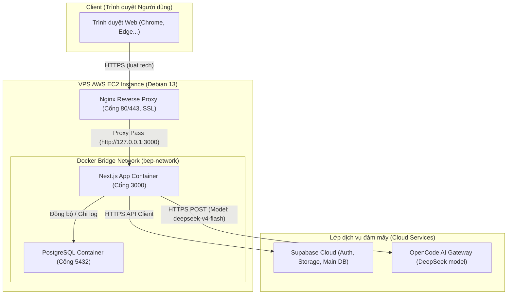
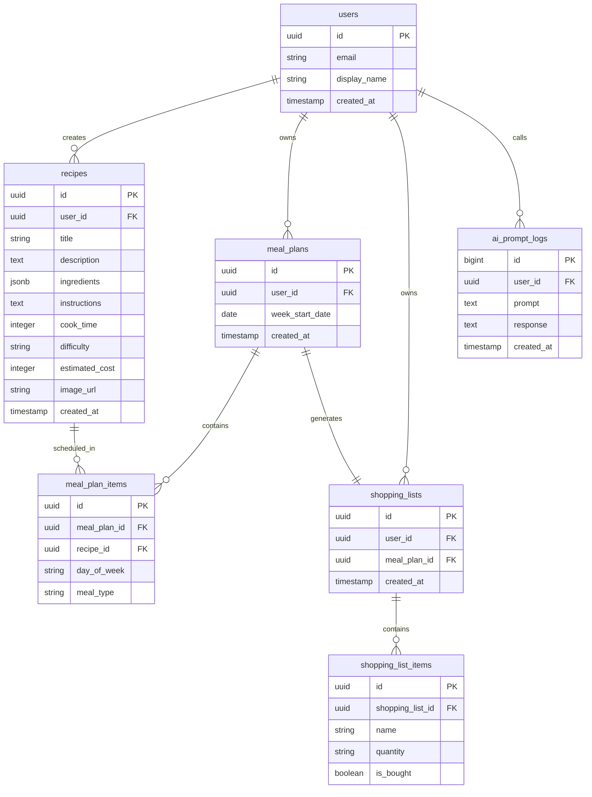

# TRƯỜNG ĐẠI HỌC ĐÀ LẠT
# KHOA CÔNG NGHỆ THÔNG TIN

---

# BÁO CÁO ĐỒ ÁN CUỐI KỲ
## MÔN HỌC: CÁC CÔNG NGHỆ MỚI TRONG PHÁT TRIỂN PHẦN MỀM

### ĐỀ TÀI: XÂY DỰNG ỨNG DỤNG QUẢN LÝ CÔNG THỨC NẤU ĂN VÀ LẬP KẾ HOẠCH THỰC ĐƠN THÔNG MINH TÍCH HỢP TRÍ TUỆ NHÂN TẠO

**Sinh viên thực hiện:** Nguyễn Văn Luật  
**Mã số sinh viên:** 2212456  
**Lớp:** CTK46-PM  
**Chuyên ngành:** Kỹ thuật phần mềm  
**Khóa:** 46  
**Giảng viên hướng dẫn:** Bộ môn Công nghệ thông tin  

---

## 1. TRANG BÌA

[VỊ TRÍ CHÈN TRANG BÌA CHÍNH THỨC CỦA TRƯỜNG ĐẠI HỌC ĐÀ LẠT]

Báo cáo đồ án cuối kỳ này trình bày quá trình nghiên cứu, thiết kế, phát triển và triển khai hệ thống quản lý ẩm thực thông minh mang tên "Bếp của Luật". Hệ thống được xây dựng trên nền tảng Next.js, tích hợp cơ sở dữ liệu Supabase, điều phối container qua Docker và triển khai thực tế trên máy chủ đám mây AWS EC2 với chứng chỉ SSL bảo mật. Đặc biệt, hệ thống tích hợp trí tuệ nhân tạo thông qua cổng OpenCode Zen API Gateway để cung cấp các tính năng thông minh như gợi ý công thức theo nguyên liệu sẵn có, thay thế nguyên liệu linh hoạt và lập kế hoạch thực đơn dinh dưỡng hàng tuần.

---

## 2. MỤC LỤC

1. TRANG BÌA
2. MỤC LỤC
3. GIỚI THIỆU
   3.1. Mô tả đề tài
   3.2. Bối cảnh thực tế và lý do chọn đề tài
   3.3. Mục tiêu hệ thống
   3.4. Ý nghĩa của đề tài
   3.5. Phạm vi thực hiện
4. CÔNG NGHỆ SỬ DỤNG
   4.1. Framework Next.js (App Router)
   4.2. Thư viện UI React
   4.3. Ngôn ngữ lập trình TypeScript
   4.4. Cơ sở dữ liệu Postgres và Backend-as-a-Service Supabase
   4.5. Công nghệ ảo hóa Docker và Docker Compose
   4.6. Dịch vụ lưu trữ Vercel và Máy chủ AWS EC2
   4.7. Cổng giao tiếp AI Tools (OpenCode Zen API Gateway / DeepSeek)
   4.8. Framework định dạng giao diện Tailwind CSS
   4.9. Giao thức REST API
   4.10. Cơ chế xác thực JWT Authentication
5. KIẾN TRÚC HỆ THỐNG
   5.1. Mô tả kiến trúc tổng thể
   5.2. Luồng hoạt động hệ thống
   5.3. Kiến trúc Client – Server
   5.4. Thiết kế cơ sở dữ liệu (Database Design)
   5.5. Sơ đồ thực thể quan hệ (ERD/Schema)
   5.6. Luồng API (API Flow)
   5.7. Luồng xác thực (Authentication Flow)
6. PHÂN TÍCH CHỨC NĂNG
   6.1. Chức năng Xác thực người dùng (Đăng ký/Đăng nhập)
   6.2. Chức năng Quản lý công thức nấu ăn (CRUD)
   6.3. Chức năng Trí tuệ nhân tạo (AI Feature)
   6.4. Chức năng Tải lên tệp tin (Upload file)
   6.5. Chức năng Bảng điều khiển (Dashboard)
   6.6. Chức năng Tìm kiếm và Lọc
   6.7. Chức năng Phân quyền dữ liệu (Row Level Security)
   6.8. Chức năng Xuất dữ liệu danh sách đi chợ (Export)
7. AI TRONG PHÁT TRIỂN
   7.1. Các công cụ AI đã sử dụng
   7.2. Cách sử dụng AI trong quá trình phát triển phần mềm
   7.3. AI hỗ trợ viết mã nguồn
   7.4. AI hỗ trợ gỡ lỗi, kiểm thử và viết tài liệu
   7.5. Các câu lệnh mẫu tiêu biểu (Typical Prompts)
   7.6. Đánh giá hiệu quả sử dụng công cụ AI
   7.7. Hạn chế khi ứng dụng AI vào phát triển phần mềm
8. DOCKER & DEPLOYMENT
   8.1. Phân tích lợi ích của công nghệ Docker
   8.2. Cấu trúc tệp tin Dockerfile
   8.3. Cấu trúc tệp tin Docker Compose
   8.4. Quy trình biên dịch dự án (Build Project)
   8.5. Quy trình triển khai trên Cloud (AWS EC2 Deployment)
   8.6. Cấu hình Nginx Reverse Proxy
   8.7. Cấu hình Domain và SSL Let's Encrypt
9. KẾT LUẬN & HẠN CHẾ
   9.1. Kết quả đạt được
   9.2. Ưu điểm của hệ thống
   9.3. Hạn chế còn tồn tại
   9.4. Khó khăn gặp phải trong quá trình thực hiện
   9.5. Hướng phát triển tương lai
10. TÀI LIỆU THAM KHẢO

---

## 3. GIỚI THIỆU

### 3.1. Mô tả đề tài
Đồ án tập trung nghiên cứu và phát triển ứng dụng quản lý công thức nấu ăn và lập kế hoạch thực đơn thông minh tích hợp trí tuệ nhân tạo mang tên "Bếp của Luật". Đây là một nền tảng Web Full-stack hiện đại, cho phép người dùng lưu trữ, tìm kiếm, biên soạn các công thức nấu ăn cá nhân hoặc cộng đồng. Điểm đặc biệt của ứng dụng là khả năng tích hợp mô hình ngôn ngữ lớn (LLM) để đưa ra các phân tích thông minh dựa trên thói quen ẩm thực của người dùng, tự động gợi ý món ăn từ những nguyên liệu có sẵn trong tủ lạnh, đề xuất các nguyên liệu thay thế tương đương khi thiếu hụt và tự động tính toán, tạo lập danh sách mua sắm tối ưu chi phí.

### 3.2. Bối cảnh thực tế và lý do chọn đề tài
Trong nhịp sống hiện đại bận rộn, việc duy trì một chế độ ăn uống lành mạnh, đủ chất dinh dưỡng và tối ưu hóa chi phí trở thành một thách thức lớn đối với nhiều gia đình và cá nhân.
Thứ nhất, người dùng thường tốn nhiều thời gian hàng ngày cho câu hỏi "Hôm nay ăn gì?". Việc lựa chọn thực đơn không có sự chuẩn bị trước dẫn đến việc lặp lại các món ăn nhàm chán hoặc không cân bằng được hàm lượng dinh dưỡng cần thiết cho cơ thể.
Thứ hai, tình trạng lãng phí thực phẩm diễn ra phổ biến. Người tiêu dùng mua sắm nguyên liệu theo cảm tính mà không có kế hoạch sử dụng cụ thể, dẫn đến việc nhiều nguyên liệu tươi sống bị hư hỏng trong tủ lạnh và buộc phải vứt bỏ. Ngược lại, có những lúc tủ lạnh còn dư thừa một số nguyên liệu nhưng người dùng lại thiếu kiến thức ẩm thực để kết hợp chúng thành một món ăn ngon.
Thứ ba, các ứng dụng quản lý ẩm thực hiện nay trên thị trường chủ yếu đóng vai trò là một kho chứa công thức tĩnh. Người dùng chỉ có thể đọc hoặc tìm kiếm cơ bản bằng từ khóa, thiếu đi sự tương tác thông minh và khả năng cá nhân hóa theo nhu cầu dinh dưỡng hoặc nguyên liệu hiện có.
Từ những lý do trên, việc phát triển một ứng dụng tích hợp trí tuệ nhân tạo (AI) kết hợp các công nghệ Cloud và DevOps hiện đại để giải quyết triệt để các vấn đề trên là vô cùng cần thiết và có ý nghĩa thực tiễn cao.

### 3.3. Mục tiêu hệ thống
Dự án hướng tới hoàn thành hai nhóm mục tiêu cốt lõi:

Mục tiêu chức năng:
- Cung cấp giao diện quản lý (CRUD) các công thức nấu ăn trực quan, cho phép đính kèm hình ảnh trực tiếp.
- Tích hợp công cụ trí tuệ nhân tạo hỗ trợ gợi ý món ăn tức thời từ danh sách nguyên liệu nhập vào.
- Tự động tạo lập thực đơn tuần (Meal Plan) cá nhân hóa cho từng thành viên.
- Tổng hợp nguyên liệu từ thực đơn tuần để tạo ra danh sách đi chợ (Shopping List) gọn gàng, hỗ trợ theo dõi trạng thái mua sắm và xuất dữ liệu.

Mục tiêu kỹ thuật:
- Sử dụng cấu trúc Next.js App Router để đạt hiệu năng tối ưu và hỗ trợ SEO tốt nhất.
- Đảm bảo toàn bộ hệ thống sử dụng TypeScript để giảm thiểu lỗi kiểm soát kiểu dữ liệu ở thời điểm biên dịch.
- Container hóa toàn bộ mã nguồn bằng Docker để dễ dàng đồng bộ môi trường phát triển và môi trường vận hành sản xuất.
- Triển khai thực tế trên máy chủ AWS EC2, thiết lập cổng chặn Nginx Reverse Proxy bảo mật thông qua giao thức HTTPS (SSL).

### 3.4. Ý nghĩa của đề tài
Ý nghĩa thực tiễn:
- Hỗ trợ người dùng tiết kiệm thời gian lập thực đơn hằng ngày và tối ưu hóa thời gian chuẩn bị thực phẩm.
- Giảm thiểu đáng kể lượng thực phẩm dư thừa bị lãng phí thông qua tính năng gợi ý tận dụng nguyên liệu sẵn có.
- Cải thiện sức khỏe cộng đồng bằng việc tính toán và kiểm soát hàm lượng dinh dưỡng tiêu thụ mỗi ngày.

Ý nghĩa học thuật:
- Giúp sinh viên nắm vững quy trình phát triển và vận hành một ứng dụng Web hiện đại theo mô hình DevOps thực tế.
- Trải nghiệm sâu sắc việc tích hợp các mô hình trí tuệ nhân tạo (AI) vào ứng dụng thông qua API Web Services.
- Tiếp cận kỹ năng cấu hình hệ thống mạng, thiết lập máy chủ đám mây Cloud, quản lý Reverse Proxy và chứng chỉ bảo mật SSL.

### 3.5. Phạm vi thực hiện
- Đối tượng sử dụng: Người nội trợ gia đình, sinh viên tự nấu ăn, người đang thực hiện chế độ ăn kiêng hoặc tập luyện dinh dưỡng.
- Phạm vi công nghệ: Ứng dụng Next.js (TypeScript), cơ sở dữ liệu quản trị PostgreSQL (Supabase), Container Docker, Web Server Nginx, SSL Let's Encrypt, Cloud VPS AWS EC2.
- Phạm vi địa lý và ngôn ngữ: Tối ưu hóa cho người dùng tại thị trường Việt Nam với giao diện tiếng Việt hoàn chỉnh, hỗ trợ nhận diện các món ăn Việt Nam truyền thống và quy đổi đơn vị tiền tệ VND.
- Thời gian thực hiện: Dự án được phát triển và hoàn thiện triển khai từ tháng 01/2026 đến tháng 05/2026.

---

## 4. CÔNG NGHỆ SỬ DỤNG

| STT | Công nghệ / Thư viện | Phiên bản | Vai trò trong hệ thống | Ghi chú |
| :--- | :--- | :--- | :--- | :--- |
| 1 | Next.js (App Router) | 14.2.3 | Framework Full-stack chính | Quản lý routing, SSR và API Routes |
| 2 | React | 18.3.1 | Thư viện dựng giao diện UI | Quản lý các Client Components tương tác |
| 3 | TypeScript | 5.4.5 | Ngôn ngữ lập trình chính | Kiểm soát kiểu dữ liệu tĩnh (Static Typing) |
| 4 | Tailwind CSS | 3.4.3 | CSS Utility Framework | Thiết kế giao diện responsive và styling |
| 5 | PostgreSQL | 17.0 | Hệ quản trị cơ sở dữ liệu quan hệ | Chạy cục bộ thông qua container Docker độc lập |
| 6 | Supabase SDK | 2.43.4 | Backend-as-a-Service Client | Xác thực tài khoản, lưu trữ ảnh và DB đám mây |
| 7 | Docker & Docker Compose | 25.0 / 2.24 | Đóng gói và điều phối container | Đóng gói Next.js và Postgres chạy biệt lập |
| 8 | Nginx | 1.26.0 | Web Server & Reverse Proxy | Giải mã SSL, định tuyến cổng 80/443 về app |
| 9 | Certbot (Let's Encrypt) | 2.1.0 | Công cụ quản lý SSL tự động | Cấp phát và tự động gia hạn chứng chỉ bảo mật |
| 10 | OpenCode AI Gateway | API v1 | Cổng tích hợp trí tuệ nhân tạo | Gọi mô hình DeepSeek để gợi ý món ăn thông minh |

### 4.1. Framework Next.js (App Router)
- Giới thiệu công nghệ: Next.js là một Framework mã nguồn mở dựa trên React, được phát triển và duy trì bởi Vercel, hỗ trợ đắc lực cho việc xây dựng các trang web hiệu năng cao.
- Vai trò trong dự án: Là nền tảng Full-stack chính của hệ thống. Next.js quản lý cấu trúc định tuyến (Routing), thực hiện hiển thị phía máy chủ (Server-side Rendering) và quản lý các API endpoints nội bộ thông qua thư mục `app/api`.
- Lý do lựa chọn: Next.js App Router cung cấp cơ chế React Server Components (RSC) giúp tối giản lượng JavaScript tải xuống trình duyệt khách, tăng tốc độ tải trang ban đầu và tối ưu SEO tốt hơn so với React SPA truyền thống.
- Ưu điểm: Tối ưu hóa hình ảnh tự động, chia tách mã nguồn (Code splitting) thông minh, hỗ trợ kết hợp đa dạng các cơ chế render (SSR, CSR, ISR) trên cùng một hệ thống.
- Hạn chế: Kiến trúc phức tạp, đòi hỏi thời gian làm quen dài hơn so với React thuần, và chi phí biên dịch (Build time) lâu hơn ở quy mô lớn.

### 4.2. Thư viện UI React
- Giới thiệu công nghệ: React là thư viện JavaScript phổ biến do Meta phát triển, chuyên dùng để xây dựng giao diện người dùng dựa trên các thành phần (Component) độc lập.
- Vai trò trong dự án: Quản lý các thành phần giao diện động tương tác phía máy khách (Client-side) như các biểu mẫu điền thông tin, thẻ công thức nấu ăn, và các nút điều hướng tương tác.
- Lý do lựa chọn: Cung cấp mô hình lập trình khai báo (Declarative) và hệ sinh thái thư viện bổ trợ vô cùng lớn, giúp tăng tốc độ thiết kế giao diện UI.
- Ưu điểm: Virtual DOM giúp cập nhật giao diện nhanh chóng, dễ dàng tái sử dụng mã nguồn thông qua cấu trúc Component và Custom Hooks.
- Hạn chế: Bản thân React chỉ là một thư viện giao diện, không cung cấp sẵn các giải pháp định tuyến, quản lý trạng thái toàn cục phức tạp hay kết nối cơ sở dữ liệu, buộc phải kết hợp thêm các công cụ bên thứ ba.

### 4.3. Ngôn ngữ lập trình TypeScript
- Giới thiệu công nghệ: TypeScript là ngôn ngữ lập trình mã nguồn mở được phát triển bởi Microsoft, đóng vai trò là một siêu tập (Superset) của JavaScript bằng cách bổ sung cơ chế kiểm soát kiểu dữ liệu tĩnh (Static Typing).
- Vai trò trong dự án: Được áp dụng xuyên suốt từ Frontend đến các API Backend giúp định nghĩa rõ ràng các giao diện dữ liệu (Interfaces) như kiểu dữ liệu của Công thức (Recipe), Thực đơn (MealPlan), và Người dùng (User).
- Lý do lựa chọn: Tránh các lỗi cơ bản như gọi sai thuộc tính đối tượng hoặc sai định dạng biến vốn rất phổ biến trong JavaScript.
- Ưu điểm: Phát hiện lỗi ngay trong quá trình viết code trên IDE, hỗ trợ tự động gợi ý code (IntelliSense) chuẩn xác, giúp mã nguồn dễ đọc và bảo trì lâu dài.
- Hạn chế: Đòi hỏi thời gian viết code ban đầu dài hơn do phải khai báo chi tiết các kiểu dữ liệu và tăng thời gian biên dịch mã nguồn sang JavaScript thuần.

### 4.4. Cơ sở dữ liệu Postgres và Backend-as-a-Service Supabase
- Giới thiệu công nghệ: Supabase là một nền tảng Backend-as-a-Service (BaaS) nguồn mở cung cấp đầy đủ các công cụ tương đương Firebase nhưng xây dựng trên nền hệ quản trị cơ sở dữ liệu quan hệ PostgreSQL mạnh mẽ.
- Vai trò trong dự án: Quản lý toàn bộ cơ sở dữ liệu quan hệ của hệ thống thông qua dịch vụ PostgreSQL đám mây, cung cấp cơ chế xác thực người dùng (Supabase Auth) và lưu trữ hình ảnh món ăn (Supabase Storage).
- Lý do lựa chọn: Tiết kiệm thời gian xây dựng máy chủ Backend độc lập từ đầu, cho phép giao tiếp trực tiếp từ client một cách an toàn thông qua cơ chế RLS.
- Ưu điểm: Hỗ trợ truy vấn SQL chuẩn xác, cung cấp API RESTful tự động dựa trên cấu trúc bảng, tích hợp sẵn cơ chế bảo mật phân quyền Row Level Security (RLS) ở mức sâu nhất.
- Hạn chế: Sự phụ thuộc cao vào dịch vụ đám mây của bên thứ ba, và việc tùy biến các business logic phức tạp ở phía Backend bị giới hạn so với việc viết server riêng.

### 4.5. Công nghệ ảo hóa Docker và Docker Compose
- Giới thiệu công nghệ: Docker là nền tảng đóng gói phần mềm dưới dạng các container độc lập chứa đầy đủ mã nguồn, thư viện và các tệp cấu hình cần thiết để ứng dụng có thể chạy ổn định ở bất kỳ đâu.
- Vai trò trong dự án: Đóng gói ứng dụng Next.js và cơ sở dữ liệu PostgreSQL cục bộ, giúp quá trình triển khai dự án từ môi trường cục bộ lên máy chủ Production diễn ra nhất quán và nhanh chóng.
- Lý do lựa chọn: Loại bỏ hoàn toàn lỗi "chạy được trên máy tôi nhưng lỗi trên server" do sai lệch phiên bản hệ điều hành hoặc môi trường Node.js.
- Ưu điểm: Trọng lượng container nhẹ, khởi động nhanh, tiết kiệm tài nguyên hệ thống hơn máy ảo truyền thống, quản lý nhiều container dễ dàng thông qua Docker Compose.
- Hạn chế: Cần thời gian cấu hình tối ưu hóa tệp Dockerfile để tránh ảnh Docker có kích thước quá lớn, làm giảm tốc độ deploy.

### 4.6. Dịch vụ lưu trữ Vercel và Máy chủ AWS EC2
- Giới thiệu công nghệ: AWS EC2 (Elastic Compute Cloud) là dịch vụ cung cấp máy chủ ảo có khả năng co giãn linh hoạt trên nền tảng đám mây của Amazon.
- Vai trò trong dự án: Là môi trường lưu trữ và chạy thực tế cuối cùng của ứng dụng Bếp của Luật. Máy chủ EC2 chạy Docker Engine để vận hành các container ứng dụng và cơ sở dữ liệu.
- Lý do lựa chọn: Máy chủ AWS mang lại độ ổn định cao, kiểm soát toàn quyền hệ thống ở cấp độ root, hỗ trợ mở cổng mạng linh hoạt và miễn phí trong gói Free Tier phù hợp cho đồ án môn học.
- Ưu điểm: Hiệu năng phần cứng ổn định, khả năng mở rộng tài nguyên dễ dàng, hỗ trợ đầy đủ các hệ điều hành Linux thông dụng.
- Hạn chế: Giao diện quản trị AWS phức tạp đối với người mới bắt đầu, đòi hỏi kỹ năng quản trị hệ điều hành Linux thông qua dòng lệnh SSH.

### 4.7. Cổng giao tiếp AI Tools (OpenCode Zen API Gateway / DeepSeek)
- Giới thiệu công nghệ: OpenCode Zen API Gateway là cổng kết nối trung gian hỗ trợ giao tiếp với các mô hình ngôn ngữ lớn (LLM) hàng đầu hiện nay, cung cấp hiệu suất cao và chi phí tối ưu.
- Vai trò trong dự án: Cung cấp trí thông minh cho các chức năng phân tích nguyên liệu, gợi ý công thức và lập kế hoạch thực đơn dựa trên mô hình `deepseek-v4-flash`.
- Lý do lựa chọn: Tích hợp dễ dàng qua giao thức API chuẩn, cung cấp tốc độ phản hồi nhanh (low latency) và miễn phí hoặc chi phí cực thấp đối với các tác vụ thử nghiệm đồ án ẩm thực.
- Ưu điểm: Khả năng xử lý ngôn ngữ tự nhiên tiếng Việt mượt mà, trả về kết quả định dạng JSON chuẩn xác giúp lập trình viên dễ dàng trích xuất dữ liệu hiển thị lên giao diện.
- Hạn chế: Có thể xuất hiện hiện tượng "ảo tưởng" (hallucination) dữ liệu nếu prompt không được thiết kế chặt chẽ.

### 4.8. Framework định dạng giao diện Tailwind CSS
- Giới thiệu công nghệ: Tailwind CSS là một CSS framework theo hướng tiện ích (Utility-first), cung cấp các lớp CSS được viết sẵn để xây dựng giao diện trực tiếp trong tệp tin HTML/React.
- Vai trò trong dự án: Định dạng kiểu dáng, màu sắc, bố cục (layout) của toàn bộ trang web.
- Lý do lựa chọn: Giúp tăng tốc độ style giao diện mà không cần chuyển đổi liên tục giữa tệp mã nguồn React và tệp CSS riêng biệt.
- Ưu điểm: Kích thước tệp CSS cuối cùng cực nhỏ sau khi lược bỏ các class không dùng, hỗ trợ thiết kế giao diện tương thích thiết bị di động (Responsive) cực kỳ trực quan.
- Hạn chế: Tên lớp class trong mã nguồn HTML/React có thể trở nên quá dài và lộn xộn nếu không được tổ chức tốt.

### 4.9. Giao thức REST API
- Giới thiệu công nghệ: REST (Representational State Transfer) là một phong cách kiến trúc thiết kế API sử dụng các phương thức HTTP tiêu chuẩn để truyền tải dữ liệu giữa Client và Server.
- Vai trò trong dự án: Xây dựng các cổng giao tiếp nội bộ giữa Frontend Next.js và các dịch vụ xử lý dữ liệu như lưu trữ thực đơn, ghi log AI và lấy danh sách mua sắm.
- Lý do lựa chọn: Cấu trúc đơn giản, dễ đọc, dễ kiểm thử bằng các công cụ như Postman.
- Ưu điểm: Tính tương thích cao, hỗ trợ tốt cơ chế caching của trình duyệt, phân tách rõ ràng trách nhiệm giữa client và server.
- Hạn chế: Có thể xảy ra hiện tượng lấy thừa dữ liệu (over-fetching) hoặc thiếu dữ liệu (under-fetching) nếu thiết kế cấu trúc API không tối ưu.

### 4.10. Cơ chế xác thực JWT Authentication
- Giới thiệu công nghệ: JSON Web Token (JWT) là một chuẩn mở định nghĩa cách thức truyền tải thông tin an toàn giữa các bên dưới dạng một đối tượng JSON đã được mã hóa và ký số.
- Vai trò trong dự án: Đảm bảo người dùng đăng nhập hợp lệ mới có quyền thao tác trên dữ liệu cá nhân của họ. Token JWT được cấp bởi Supabase Auth sau khi đăng nhập thành công.
- Lý do lựa chọn: Cơ chế stateless giúp máy chủ không cần lưu trạng thái phiên làm việc (Session) trong cơ sở dữ liệu, nâng cao hiệu năng hệ thống.
- Ưu điểm: Tính bảo mật cao nhờ chữ ký số mã hóa, dễ dàng tích hợp qua Middleware để chặn các yêu cầu không hợp lệ.
- Hạn chế: Khó thu hồi token trước thời hạn hết hạn một cách trực tiếp nếu không áp dụng cơ chế blacklist phức tạp.

---

## 5. KIẾN TRÚC HỆ THỐNG

### 5.1. Mô tả kiến trúc tổng thể
Hệ thống "Bếp của Luật" được thiết kế dựa trên kiến trúc phân tầng (Multi-tier Architecture) hiện đại nhằm đảm bảo khả năng bảo mật, tính độc lập của các module và dễ dàng nâng cấp bảo trì.

[HÌNH 5.1: SƠ ĐỒ KIẾN TRÚC TỔNG THỂ CỦA HỆ THỐNG BEPCUALUAT]



---
*Hướng dẫn chụp/vẽ ảnh minh họa cho Hình 5.1 (Sinh viên xóa phần hướng dẫn này sau khi chèn ảnh):*
- **Mục đích:** Minh họa trực quan cách các thành phần trong hệ thống Bếp của Luật tương tác với nhau, từ người dùng truy cập internet, đi qua Nginx trên VPS AWS, vào container Next.js và Postgres, đến việc giao tiếp với Supabase và OpenCode AI Gateway.
- **Cách vẽ sơ đồ:** 
  1. Sử dụng công cụ vẽ sơ đồ trực tuyến như Draw.io (diagrams.net), Lucidchart hoặc vẽ trực tiếp bằng ngôn ngữ Mermaid.
  2. Tạo 3 phân vùng chính từ trái qua phải:
     - **Client (Người dùng):** Trình duyệt Web (Chrome, Edge) thực hiện gửi yêu cầu HTTPS.
     - **VPS AWS EC2 (Môi trường máy chủ ảo):** 
       - Cửa ngõ Nginx Reverse Proxy (lắng nghe cổng 80/443).
       - Docker Bridge Network (mạng nội bộ bảo mật của Docker) chứa 2 Container: Container Next.js App (cổng 3000) và Container PostgreSQL Database (cổng 5432).
     - **Lớp dịch vụ đám mây bên ngoài (External Services):** Supabase (Auth, Storage, Database chính) và OpenCode AI Gateway (DeepSeek model).
  3. Vẽ các đường mũi tên thể hiện luồng dữ liệu hai chiều: Trình duyệt -> Nginx (HTTPS) -> Next.js (cổng 3000) -> Database/Services.
  4. Xuất sơ đồ ra định dạng ảnh PNG hoặc JPEG, chèn trực tiếp thay thế dòng này.
---

Hệ thống bao gồm các thành phần chính:
1. **Lớp cổng vào (Nginx Reverse Proxy)**: Đóng vai trò là chốt chặn đầu tiên trên máy chủ AWS EC2. Nginx nhận các yêu cầu truy cập HTTPS từ người dùng qua cổng 443, thực hiện giải mã SSL và chuyển tiếp yêu cầu HTTP nội bộ về cổng 3000 của ứng dụng.
2. **Lớp ứng dụng (Next.js Application Container)**: Vận hành bên trong container Docker. Thành phần này xử lý hiển thị giao diện UI cho người dùng (Client Components) và xử lý các logic nghiệp vụ, kết nối API (Server Actions & API Routes).
3. **Lớp dữ liệu cục bộ (PostgreSQL Container)**: Chứa cơ sở dữ liệu quan hệ cục bộ dùng để đồng bộ hoặc lưu trữ các thông tin bổ trợ, chạy song song trong mạng nội bộ của Docker.
4. **Lớp dịch vụ đám mây bên ngoài (External Services)**:
   - **Supabase Cloud**: Cung cấp xác thực người dùng, lưu trữ tệp hình ảnh món ăn và vận hành cơ sở dữ liệu chính của hệ thống dưới cơ chế bảo mật RLS.
   - **OpenCode AI Gateway**: Nhận các yêu cầu xử lý trí tuệ nhân tạo từ Next.js server để phân tích nguyên liệu và sinh thực đơn.

### 5.2. Luồng hoạt động hệ thống
Quy trình xử lý một yêu cầu tiêu biểu từ người dùng trên hệ thống diễn ra qua các bước sau:
Bước 1: Người dùng truy cập trang web thông qua trình duyệt bằng đường dẫn an toàn `https://luat.tech`.
Bước 2: Yêu cầu đi qua cổng bảo mật của AWS Security Group đến dịch vụ Nginx trên cổng 443. Nginx xác thực SSL hợp lệ và chuyển tiếp yêu cầu vào cổng 3000 của Docker container chứa Next.js.
Bước 3: Next.js xử lý yêu cầu. Nếu là yêu cầu trang tĩnh, Next.js phản hồi lập tức. Nếu yêu cầu cần dữ liệu, Next.js Server Components sẽ thiết lập kết nối an toàn đến database Supabase hoặc gửi request qua API của OpenCode AI để xử lý tác vụ thông minh.
Bước 4: Dữ liệu trả về được Next.js tổng hợp, kết xuất thành mã HTML/JSON và gửi trả lại trình duyệt thông qua Nginx Reverse Proxy.

### 5.3. Kiến trúc Client – Server
Dự án áp dụng mô hình phân tách rõ ràng vai trò Client và Server nhờ vào kiến trúc Next.js App Router:
- **Server Components (Hiển thị phía máy chủ)**: Các trang như danh sách công thức, chi tiết món ăn được render trực tiếp trên server. Điều này giúp lấy dữ liệu từ Supabase cực nhanh vì khoảng cách mạng giữa Next.js server và Supabase database rất nhỏ. Giao diện được tạo sẵn dưới dạng HTML gửi về client giúp trang web hiển thị tức thì.
- **Client Components (Tương tác phía trình duyệt)**: Các nút bấm thêm nguyên liệu, biểu mẫu chỉnh sửa công thức, hoặc biểu đồ tương tác sử dụng directive `'use client'`. Các thành phần này chạy trực tiếp trên trình duyệt của người dùng để phản hồi lập tức các tương tác mà không cần tải lại toàn bộ trang web.

### 5.4. Thiết kế cơ sở dữ liệu (Database Design)
Hệ thống sử dụng cơ sở dữ liệu quan hệ PostgreSQL với các bảng được thiết kế chuẩn hóa để tránh trùng lặp thông tin và tăng hiệu năng truy vấn.

| STT | Tên bảng (Table Name) | Mục đích sử dụng | Khóa chính (PK) | Khóa ngoại (FK) | Ghi chú |
| :--- | :--- | :--- | :--- | :--- | :--- |
| 1 | `users` | Lưu trữ hồ sơ thông tin người dùng | `id` (UUID) | Không | Đồng bộ tự động với Supabase Auth |
| 2 | `recipes` | Lưu trữ các công thức nấu ăn | `id` (UUID) | `user_id` -> `users(id)` | Có cột `ingredients` dạng JSONB |
| 3 | `meal_plans` | Quản lý kế hoạch thực đơn tuần | `id` (UUID) | `user_id` -> `users(id)` | Lưu ngày đầu tuần `week_start_date` |
| 4 | `meal_plan_items` | Chi tiết món ăn trong thực đơn tuần| `id` (UUID) | `meal_plan_id` -> `meal_plans(id)`, `recipe_id` -> `recipes(id)` | Liên kết thứ trong tuần và bữa ăn |
| 5 | `shopping_lists` | Quản lý danh sách đi chợ tuần | `id` (UUID) | `user_id` -> `users(id)`, `meal_plan_id` -> `meal_plans(id)` | Khởi tạo từ thực đơn tương ứng |
| 6 | `shopping_list_items`| Chi tiết các nguyên liệu cần mua | `id` (UUID) | `shopping_list_id` -> `shopping_lists(id)` | Có trường kiểm tra trạng thái `is_bought` |
| 7 | `ai_prompt_logs` | Ghi lịch sử hoạt động gọi AI | `id` (Bigint) | `user_id` -> `users(id)` | Lưu vết prompt gửi đi và response nhận về |

Chi tiết cấu trúc các bảng chính:
- **Bảng `users`**: Lưu trữ thông tin hồ sơ của người dùng đăng ký hệ thống.
- **Bảng `recipes`**: Lưu trữ chi tiết các công thức nấu ăn, bao gồm cột `ingredients` định dạng JSONB để tối ưu hóa việc tìm kiếm và lọc nguyên liệu linh hoạt.
- **Bảng `meal_plans`**: Lưu trữ thông tin tổng quan về kế hoạch thực đơn tuần của người dùng.
- **Bảng `meal_plan_items`**: Lưu trữ chi tiết các món ăn được xếp lịch vào các ngày trong tuần (từ Thứ Hai đến Chủ Nhật) và các bữa ăn (Sáng, Trưa, Tối).
- **Bảng `shopping_lists`**: Quản lý danh sách đi chợ được tạo tự động từ thực đơn.
- **Bảng `shopping_list_items`**: Chi tiết từng nguyên liệu cần mua kèm theo trạng thái đã mua hay chưa.
- **Bảng `ai_prompt_logs`**: Ghi lại lịch sử các prompt đã gửi lên AI và kết quả phản hồi nhằm mục đích hậu kiểm và tối ưu hóa hệ thống gợi ý.

### 5.5. Sơ đồ thực thể quan hệ (ERD/Schema)
Mối quan hệ giữa các bảng được thiết lập chặt chẽ thông qua các ràng buộc khóa ngoại (Foreign Keys):
- Một người dùng (`users`) có thể tạo ra nhiều công thức (`recipes`) và sở hữu nhiều thực đơn tuần (`meal_plans`). Mối quan hệ là 1 - Nhiều.
- Một thực đơn tuần (`meal_plans`) chứa nhiều mục món ăn chi tiết (`meal_plan_items`). Khi một thực đơn tuần bị xóa, toàn bộ các mục chi tiết liên quan sẽ bị xóa theo cơ chế Cascade (`ON DELETE CASCADE`).
- Mỗi mục thực đơn tuần (`meal_plan_items`) liên kết trực tiếp đến một công thức cụ thể (`recipes`).
- Một kế hoạch thực đơn (`meal_plans`) liên kết với một danh sách đi chợ (`shopping_lists`), từ đó chứa nhiều nguyên liệu cần mua (`shopping_list_items`).

[HÌNH 5.2: SƠ ĐỒ THỰC THỂ QUAN HỆ - ENTITY RELATIONSHIP DIAGRAM (ERD)]



---
*Hướng dẫn chụp/vẽ ảnh minh họa cho Hình 5.2 (Sinh viên xóa phần hướng dẫn này sau khi chèn ảnh):*
- **Mục đích:** Trực quan hóa cấu trúc các bảng và mối liên kết khóa ngoại giữa các thực thể dữ liệu chính trong hệ thống (như users, recipes, meal_plans, meal_plan_items, shopping_lists, shopping_list_items, ai_prompt_logs).
- **Cách thực hiện:**
  - **Cách 1 (Khuyên dùng - Sử dụng công cụ tự động):** Truy cập trang web dbdiagram.io. Copy toàn bộ mã SQL tạo bảng trong tệp tin docs/schema.sql.txt hoặc phần Phụ lục của báo cáo này và dán vào ô soạn thảo của dbdiagram.io. Công cụ sẽ tự động vẽ một sơ đồ thực thể quan hệ ERD chuẩn chỉnh. Chụp lại màn hình sơ đồ này.
  - **Cách 2 (Sử dụng Supabase Dashboard):** Đăng nhập vào bảng điều khiển Supabase của dự án. Chọn mục Database ở thanh công cụ bên trái -> Chọn Schema Visualizer. Supabase sẽ tự động hiển thị sơ đồ các bảng trong schema public cùng các đường nối thể hiện khóa ngoại. Phóng to hoặc thu nhỏ trình duyệt để thấy rõ đầy đủ các bảng rồi chụp lại màn hình.
---

### 5.6. Luồng API (API Flow)
Các yêu cầu API từ client gửi lên hệ thống được xử lý thông qua luồng khép kín:
1. Client gửi request (ví dụ: `POST /api/ai/suggest-from-ingredients`) đính kèm dữ liệu danh sách nguyên liệu dưới dạng JSON.
2. Next.js API route tiếp nhận request, kiểm tra tính hợp lệ của token xác thực của người dùng gửi kèm trong headers.
3. Server thực hiện gọi API ngoại vi đến OpenCode Zen Gateway, gửi kèm prompt đã chuẩn hóa cấu trúc.
4. OpenCode xử lý prompt, trả dữ liệu JSON chứa tên các món ăn đề xuất về Next.js.
5. Server ghi nhận log cuộc gọi vào bảng `ai_prompt_logs` trong cơ sở dữ liệu để phục vụ việc giám sát, sau đó đóng gói kết quả và trả về cho trình duyệt hiển thị.

### 5.7. Luồng xác thực (Authentication Flow)
Cơ chế xác thực người dùng hoạt động theo quy trình bảo mật nghiêm ngặt:
1. Người dùng nhập email và mật khẩu tại trang đăng nhập.
2. Thông tin được gửi trực tiếp đến Supabase Auth Service thông qua giao thức HTTPS bảo mật.
3. Supabase xác thực thông tin tài khoản hợp lệ, tạo ra một Access Token dạng JWT và một Refresh Token.
4. Trình duyệt lưu trữ Access Token này vào Cookie hoặc Local Storage để tự động đính kèm vào tất cả các yêu cầu dữ liệu tiếp theo.
5. Next.js Middleware chặn các yêu cầu truy cập vào vùng quản trị (ví dụ: `/dashboard`, `/di-cho`), giải mã chữ ký số của JWT Token để kiểm tra tính hợp lệ của phiên làm việc. Nếu hợp lệ, cho phép tiếp tục truy cập; nếu không, tự động chuyển hướng người dùng về trang đăng nhập `/account/signin`.

---

## 6. PHÂN TÍCH CHỨC NĂNG

| STT | Tên chức năng | Mô tả chi tiết nghiệp vụ | Các bảng tác động | Thao tác CRUD |
| :--- | :--- | :--- | :--- | :--- |
| 1 | Xác thực người dùng | Đăng ký, kích hoạt email, đăng nhập bảo mật | `users` | **C**reate, **R**ead |
| 2 | Quản lý công thức | Thêm, xem, cập nhật, xóa công thức nấu ăn | `recipes` | **C**reate, **R**ead, **U**pdate, **D**elete |
| 3 | Gợi ý món ăn bằng AI | Gửi nguyên liệu lên DeepSeek, nhận gợi ý món ăn | `recipes`, `ai_prompt_logs` | **R**ead, **C**reate (Log) |
| 4 | Tải tệp tin hình ảnh | Upload hình ảnh thành phẩm món ăn lên Storage | `recipes` (URL ảnh) | **U**pdate |
| 5 | Lập thực đơn tuần | Lên lịch chi tiết bữa ăn cho các ngày trong tuần | `meal_plans`, `meal_plan_items` | **C**reate, **R**ead, **U**pdate, **D**elete |
| 6 | Danh sách đi chợ | Tổng hợp nguyên liệu cần mua từ thực đơn | `shopping_lists`, `shopping_list_items` | **C**reate, **R**ead, **U**pdate |
| 7 | Xuất danh sách đi chợ | Xuất tệp tin đính kèm định dạng `.txt` hoặc `.csv` | `shopping_lists`, `shopping_list_items` | **R**ead |
| 8 | Tìm kiếm và lọc | Tìm kiếm toàn văn bản và lọc theo tiêu chí | `recipes` | **R**ead |

### 6.1. Chức năng Xác thực người dùng (Đăng ký/Đăng nhập)
- Mục đích: Đảm bảo tính riêng tư dữ liệu và cho phép cá nhân hóa thực đơn cho từng người dùng cụ thể.
- Cách hoạt động: Người dùng đăng ký tài khoản mới bằng địa chỉ email hợp lệ hoặc đăng nhập bằng tài khoản sẵn có. Hệ thống tự động thiết lập phiên làm việc an toàn.
- Dữ liệu đầu vào (Input): Email người dùng, mật khẩu (độ dài tối thiểu 6 ký tự).
- Dữ liệu đầu ra (Output): JWT Token, thông tin cơ bản của người dùng (họ tên, email, avatar).
- Quy trình xử lý: Người dùng gửi yêu cầu đăng ký -> Hệ thống mã hóa thông tin tài khoản -> Gửi yêu cầu lưu trữ và tạo tài khoản trên Supabase Auth -> Người dùng nhận email kích hoạt -> Đăng nhập thành công và nhận JWT Token.
- Đề xuất vị trí chèn ảnh: [HÌNH 6.1: GIAO DIỆN TRANG ĐĂNG NHẬP VÀ ĐĂNG KÝ HỆ THỐNG]

---
*Hướng dẫn chụp ảnh minh họa cho Hình 6.1 (Sinh viên xóa phần hướng dẫn này sau khi chèn ảnh):*
- **Mục đích:** Minh chứng tính năng đăng ký, đăng nhập tài khoản thông qua Supabase Auth hoạt động ổn định và bảo mật với HTTPS.
- **Cách chụp thực tế:**
  1. Mở trình duyệt ở chế độ ẩn danh (incognito) để đảm bảo không bị tự động đăng nhập.
  2. Truy cập địa chỉ trang đăng nhập: `https://luat.tech/account/signin` (hoặc click nút "Đăng nhập" trên giao diện).
  3. Nhập thử một tài khoản email mẫu (ví dụ: `nguyenvanluat@gmail.com`) và mật khẩu mẫu vào các trường nhập liệu (chưa cần nhấn nút gửi).
  4. Chụp ảnh màn hình trang Đăng nhập. **Lưu ý:** Hãy chụp toàn màn hình trình duyệt hoặc giữ lại thanh địa chỉ của trình duyệt để thấy rõ URL là `https://luat.tech/account/signin` cùng biểu tượng ổ khóa xanh (chứng chỉ SSL hợp lệ).
  5. Tiếp tục truy cập trang đăng ký tại `https://luat.tech/account/signup` và chụp ảnh giao diện đăng ký tài khoản mới tương tự.
  6. Sử dụng một công cụ chỉnh sửa ảnh đơn giản để ghép hai bức ảnh Đăng ký và Đăng nhập này cạnh nhau hoặc xếp chồng lên nhau thành một ảnh duy nhất để chèn vào báo cáo.
---

### 6.2. Chức năng Quản lý công thức nấu ăn (CRUD)
- Mục đích: Cho phép người dùng xây dựng sổ tay ẩm thực cá nhân trực tuyến.
- Cách hoạt động: Người dùng thực hiện các thao tác thêm mới công thức, chỉnh sửa thông tin nguyên liệu hoặc xóa các công thức không còn nhu cầu sử dụng.
- Dữ liệu đầu vào (Input): Tên món ăn, mô tả, danh sách nguyên liệu kèm định lượng, các bước thực hiện chi tiết, thời gian nấu, mức độ khó, chi phí ước tính, hình ảnh món ăn.
- Dữ liệu đầu ra (Output): Bản ghi công thức được cập nhật thành công trong bảng `recipes`.
- Quy trình xử lý: Người dùng điền thông tin vào biểu mẫu -> Nhấn lưu -> Next.js gửi yêu cầu đến Supabase Database -> Thực hiện kiểm tra quyền sở hữu bản ghi -> Lưu dữ liệu và phản hồi thông báo thành công cho người dùng.
- Đề xuất vị trí chèn ảnh: [HÌNH 6.2: GIAO DIỆN QUẢN LÝ VÀ CHỈNH SỬA CÔNG THỨC NẤU ĂN]

---
*Hướng dẫn chụp ảnh minh họa cho Hình 6.2 (Sinh viên xóa phần hướng dẫn này sau khi chèn ảnh):*
- **Mục đích:** Minh chứng giao diện CRUD công thức nấu ăn hoạt động đầy đủ, cho phép người dùng biên soạn và cập nhật dữ liệu ẩm thực cá n### 6.8. Chức năng Xuất dữ liệu danh sách đi chợ (Export)
- Mục đích: Cho phép người dùng dễ dàng lưu trữ, chia sẻ hoặc mang danh sách nguyên liệu đi chợ ra cửa hàng thực phẩm mà không cần mở ứng dụng.
- Cách hoạt động: Xuất toàn bộ danh sách nguyên liệu cần mua từ kế hoạch tuần ra định dạng tệp tin Text (.txt) hoặc bảng tính CSV (.csv).
- Dữ liệu đầu vào (Input): Danh sách nguyên liệu cần mua hiện tại.
- Dữ liệu đầu ra (Output): Tệp tin tải xuống dạng `.txt` hoặc `.csv` chứa danh sách nguyên liệu sạch sẽ, rõ ràng kèm định lượng.
- Quy trình xử lý: Người dùng nhấn nút Export -> Client chuyển đổi danh sách đối tượng nguyên liệu thành chuỗi ký tự phân cách bằng dấu phẩy (CSV) hoặc định dạng danh sách gạch đầu dòng (Text) -> Trình duyệt kích hoạt sự kiện tải tệp tin tự động về máy tính người dùng.
- Đề xuất vị trí chèn ảnh: [HÌNH 6.7: TÍNH NĂNG VÀ TỆP TIN SAU KHI XUẤT DỮ LIỆU DANH SÁCH ĐI CHỢ THÀNH CÔNG]

---
*Hướng dẫn chụp ảnh minh họa cho Hình 6.7 (Sinh viên xóa phần hướng dẫn này sau khi chèn ảnh):*
- **Mục đích:** Minh chứng tính năng xuất dữ liệu danh sách đi chợ ra tệp tin vật lý để mang đi chợ hoạt động tốt.
- **Cách chụp thực tế:**
  1. Truy cập trang quản lý Danh sách đi chợ (`https://luat.tech/shopping-list`).
  2. Click vào nút "Xuất danh sách đi chợ" (chọn định dạng xuất là `.txt` hoặc `.csv`).
  3. Đợi trình duyệt tải tệp tin về máy tính. Mở tệp tin đó lên bằng công cụ đọc tương ứng (ví dụ: Mở tệp `.txt` bằng Notepad, mở tệp `.csv` bằng Microsoft Excel hoặc WPS Office).
  4. Thu nhỏ cửa sổ trình duyệt (đang hiển thị trang danh sách đi chợ trên web) và cửa sổ tệp tin vừa tải về, đặt chúng song song cạnh nhau trên màn hình máy tính.
  5. Chụp ảnh màn hình toàn cảnh để minh chứng rõ ràng sự trùng khớp dữ liệu giữa giao diện web Bếp của Luật và nội dung tệp tin đã được tải về.
---��i dùng lưu trữ hình ảnh thực tế của món ăn để trực quan hóa sổ tay công thức.
- Cách hoạt động: Người dùng nhấn chọn ảnh từ thiết bị cục bộ, hệ thống tự động tải ảnh lên dịch vụ lưu trữ đám mây và trả về liên kết URL an toàn.
- Dữ liệu đầu vào (Input): Tệp tin hình ảnh dạng PNG, JPEG, hoặc WebP (kích thước tối đa 5MB).
- Dữ liệu đầu ra (Output): URL truy cập hình ảnh công khai trên Supabase Storage.
- Quy trình xử lý: Chọn tệp -> Client gửi yêu cầu upload trực tiếp lên Supabase Storage bucket `recipe-images` -> Nhận URL phản hồi -> Điền URL vào trường `image_url` của bản ghi công thức tương ứng.
- Đề xuất vị trí chèn ảnh: [HÌNH 6.4: BƯỚC TẢI ẢNH MÓN ĂN LÊN KHI TẠO CÔNG THỨC MỚI]

---
*Hướng dẫn chụp ảnh minh họa cho Hình 6.4 (Sinh viên xóa phần hướng dẫn này sau khi chèn ảnh):*
- **Mục đích:** Minh chứng khả năng tương tác với Supabase Storage để tải lên hình ảnh món ăn trực tiếp lên cloud bucket.
- **Cách chụp thực tế:**
  1. Mở Form tạo mới hoặc chỉnh sửa công thức nấu ăn.
  2. Tìm khu vực tải ảnh lên (thường có nút "Chọn ảnh từ thiết bị" hoặc biểu tượng kéo thả ảnh).
  3. Chọn tải lên một tệp hình ảnh món ăn thực tế bất kỳ.
  4. Ngay khi hệ thống upload thành công và hiển thị ảnh xem trước (Preview) ở trên giao diện Form tạo công thức, hãy chụp ảnh màn hình khu vực này.
  5. **Mẹo kỹ thuật bổ sung:** Bạn có thể mở F12 (Inspect Element) của trình duyệt lên để thấy đường dẫn ảnh bắt đầu bằng domain Supabase của bạn (ví dụ: `https://[project-id].supabase.co/storage/v1/object/public/recipe-images/...`) để chứng minh dữ liệu được lưu trữ đúng chỗ, hoặc chỉ cần chụp ảnh giao diện hiển thị ảnh xem trước sắc nét là đủ.
---

### 6.5. Chức năng Bảng điều khiển (Dashboard)
- Mục đích: Cung cấp cái nhìn tổng quan về thói quen ăn uống, chi tiêu ẩm thực và tiến độ thực đơn tuần của người dùng.
- Cách hoạt động: Hiển thị các thông số thống kê dạng biểu đồ trực quan ngay sau khi người dùng đăng nhập.
- Dữ liệu đầu vào (Input): ID của người dùng đăng nhập.
- Dữ liệu đầu ra (Output): Số liệu tổng hợp số lượng công thức đã tạo, số lượng thực đơn tuần đã lên kế hoạch, ngân sách dự kiến đã chi tiêu và phân bổ dinh dưỡng.
- Quy trình xử lý: Client truy cập Dashboard -> Gọi API thống kê dữ liệu -> Server truy vấn cơ sở dữ liệu tính tổng các bản ghi liên quan -> Phản hồi số liệu tổng hợp -> Client render các biểu đồ tương tác.
- Đề xuất vị trí chèn ảnh: [HÌNH 6.5: GIAO DIỆN BẢNG ĐIỀU KHIỂN THỐNG KÊ CHI TIẾT NGƯỜI DÙNG]

---
*Hướng dẫn chụp ảnh minh họa cho Hình 6.5 (Sinh viên xóa phần hướng dẫn này sau khi chèn ảnh):*
- **Mục đích:** Minh họa tính năng Bảng điều khiển (Dashboard) tổng hợp thông số hoạt động, cung cấp cái nhìn tổng quan về thói quen ẩm thực của người dùng.
- **Cách chụp thực tế:**
  1. Hãy chắc chắn rằng tài khoản của bạn đã được tạo sẵn một số dữ liệu kiểm thử (ví dụ: đã tạo tối thiểu 3 công thức nấu ăn, đã lên kế hoạch 1 thực đơn tuần).
  2. Đăng nhập và truy cập trực tiếp vào trang `/dashboard` (hoặc click nút "Bảng điều khiển").
  3. Đợi các biểu đồ thống kê và các số liệu đếm tổng hợp tải xong và kết xuất đầy đủ.
  4. Chụp ảnh màn hình toàn bộ khu vực Dashboard hiển thị các khối số liệu (Tổng số công thức, Số lượng thực đơn, biểu đồ phân bổ...). Đảm bảo thiết kế cân đối, hiển thị rõ ràng.
---

### 6.6. Chức năng Tìm kiếm và Lọc
- Mục đích: Giúp người dùng nhanh chóng tìm thấy công thức mong muốn trong kho dữ liệu lớn.
- Cách hoạt động: Tìm kiếm toàn văn bản (Full-text search) theo tên món ăn và lọc theo mức độ khó, thời gian chế biến hoặc khoảng chi phí mong muốn.
- Dữ liệu đầu vào (Input): Từ khóa tìm kiếm, các tiêu chí lọc giao diện.
- Dữ liệu đầu ra (Output): Danh sách các công thức thỏa mãn điều kiện.
- Quy trình xử lý: Người dùng gõ từ khóa -> Gọi API tìm kiếm -> Sử dụng truy vấn `ILIKE` hoặc chỉ mục GIN trên PostgreSQL để tìm kiếm nhanh chóng -> Trả kết quả danh sách công thức hiển thị dạng lưới (Grid layout).
- Đề xuất vị trí chèn ảnh: [HÌNH 6.6: THANH TÌM KIẾM VÀ CÁC NÚT BỘ LỌC CÔNG THỨC NÂNG CAO]
---
*Hướng dẫn chụp ảnh minh họa cho Hình 6.6 (Sinh viên xóa phần hướng dẫn này sau khi chèn ảnh):*
- **Mục đích:** Minh chứng bộ lọc tìm kiếm nâng cao (Tìm kiếm theo tên và lọc theo độ khó, thời gian) hoạt động ổn định và chính xác.
- **Cách chụp thực tế:**
  1. Truy cập vào trang danh mục tất cả công thức nấu ăn (`https://luat.tech/recipes`).
  2. Nhập một từ khóa tìm kiếm cụ thể vào ô tìm kiếm (ví dụ: *Cơm* hoặc *Thịt*).
  3. Lựa chọn một vài bộ lọc nâng cao trên thanh công cụ lọc (ví dụ: chọn Độ khó: *Dễ*, chọn Thời gian nấu: *Dưới 30 phút*).
  4. Chụp ảnh màn hình giao diện hiển thị từ khóa đã gõ, các nút bộ lọc đang được kích hoạt (in đậm hoặc đổi màu) và danh sách các món ăn tương ứng đã được lọc tự động hiển thị bên dưới.
---

### 6.7. Chức năng Phân quyền dữ liệu (Row Level Security)
- Mục đích: Đảm bảo người dùng chỉ có quyền thao tác trên dữ liệu do chính mình tạo ra, ngăn chặn hành vi xâm nhập dữ liệu chéo trái phép.
- Cách hoạt động: Kích hoạt chính sách RLS trực tiếp trên các bảng dữ liệu trong cơ sở dữ liệu Supabase PostgreSQL.
- Dữ liệu đầu vào (Input): Phiên làm việc (Session) của người dùng kèm JWT Token.
- Dữ liệu đầu ra (Output): Quyền truy cập được chấp thuận (Allow) hoặc từ chối (Deny HTTP 403).
- Quy trình xử lý: Client gửi câu lệnh truy vấn SQL -> Database kiểm tra thuộc tính `user_id` của dòng dữ liệu trùng khớp với trường `auth.uid()` của token JWT gửi kèm -> Chỉ thực hiện hành động SELECT/UPDATE/DELETE nếu điều kiện thỏa mãn.

### 6.8. Chức năng Thống kê dinh dưỡng và chi phí
- Mục đích: Kiểm soát chế độ ăn uống lành mạnh và quản lý ngân sách sinh hoạt hợp lý.
- Cách hoạt động: Tổng hợp lượng Calories, Protein, Carbs, Fat và ước tính chi phí của tất cả món ăn nằm trong kế hoạch thực đơn tuần hiện tại.
- Dữ liệu đầu vào (Input): Thực đơn tuần được chọn.
- Dữ liệu đầu ra (Output): Bảng tổng hợp tổng lượng dinh dưỡng hằng ngày và tổng chi phí ngân sách dự kiến của cả tuần.
- Quy trình xử lý: Hệ thống đọc danh sách món ăn trong thực đơn -> Lấy thông tin chi tiết dinh dưỡng và chi phí từ bảng công thức -> Thực hiện phép tính cộng dồn trên máy chủ -> Trả về cấu trúc dữ liệu tổng hợp để vẽ biểu đồ dinh dưỡng.
- Đề xuất vị trí chèn ảnh: [HÌNH 6.7: BIỂU ĐỒ TRỰC QUAN HÓA DINH DƯỠNG VÀ ƯỚC TÍNH CHI PHÍ THỰC ĐƠN TUẦN]

---
*Hướng dẫn chụp ảnh minh họa cho Hình 6.7 (Sinh viên xóa phần hướng dẫn này sau khi chèn ảnh):*
- **Mục đích:** Minh chứng tính năng tự động tổng hợp dinh dưỡng và ước tính chi phí cho thực đơn tuần của người dùng, giúp tối ưu hóa ngân sách và chế độ ăn.
- **Cách chụp thực tế:**
  1. Truy cập vào tính năng Lập thực đơn tuần (`https://luat.tech/meal-plan`).
  2. Chọn một thực đơn tuần đã lên kế hoạch hoàn chỉnh (đã chọn các món ăn cho các bữa trong tuần).
  3. Kéo màn hình xuống phần hiển thị thông tin Dinh dưỡng & Chi phí. Tại đây sẽ xuất hiện các biểu đồ (ví dụ: biểu đồ tròn/cột phân tích tỷ lệ Calories, Protein, Carbs, Fat) và bảng ước tính tổng chi phí mua sắm.
  4. Chụp ảnh màn hình tập trung vào khu vực hiển thị các biểu đồ thống kê này.
---

### 6.9. Chức năng Xuất dữ liệu danh sách đi chợ (Export)
- Mục đích: Cho phép người dùng dễ dàng lưu trữ, chia sẻ hoặc mang danh sách nguyên liệu đi chợ ra cửa hàng thực phẩm mà không cần mở ứng dụng.
- Cách hoạt động: Xuất toàn bộ danh sách nguyên liệu cần mua từ kế hoạch tuần ra định dạng tệp tin Text (.txt) hoặc bảng tính CSV (.csv).
- Dữ liệu đầu vào (Input): Danh sách nguyên liệu cần mua hiện tại.
- Dữ liệu đầu ra (Output): Tệp tin tải xuống dạng `.txt` hoặc `.csv` chứa danh sách nguyên liệu sạch sẽ, rõ ràng kèm định lượng.
- Quy trình xử lý: Người dùng nhấn nút Export -> Client chuyển đổi danh sách đối tượng nguyên liệu thành chuỗi ký tự phân cách bằng dấu phẩy (CSV) hoặc định dạng danh sách gạch đầu dòng (Text) -> Trình duyệt kích hoạt sự kiện tải tệp tin tự động về máy tính người dùng.
- Đề xuất vị trí chèn ảnh: [HÌNH 6.8: TÍNH NĂNG VÀ TỆP TIN SAU KHI XUẤT DỮ LIỆU DANH SÁCH ĐI CHỢ THÀNH CÔNG]

---
*Hướng dẫn chụp ảnh minh họa cho Hình 6.8 (Sinh viên xóa phần hướng dẫn này sau khi chèn ảnh):*
- **Mục đích:** Minh chứng tính năng xuất dữ liệu danh sách đi chợ ra tệp tin vật lý để mang đi chợ hoạt động tốt.
- **Cách chụp thực tế:**
  1. Truy cập trang quản lý Danh sách đi chợ (`https://luat.tech/shopping-list`).
  2. Click vào nút "Xuất danh sách đi chợ" (chọn định dạng xuất là `.txt` hoặc `.csv`).
  3. Đợi trình duyệt tải tệp tin về máy tính. Mở tệp tin đó lên bằng công cụ đọc tương ứng (ví dụ: Mở tệp `.txt` bằng Notepad, mở tệp `.csv` bằng Microsoft Excel hoặc WPS Office).
  4. Thu nhỏ cửa sổ trình duyệt (đang hiển thị trang danh sách đi chợ trên web) và cửa sổ tệp tin vừa tải về, đặt chúng song song cạnh nhau trên màn hình máy tính.
  5. Chụp ảnh màn hình toàn cảnh để minh chứng rõ ràng sự trùng khớp dữ liệu giữa giao diện web Bếp của Luật và nội dung tệp tin đã được tải về.
---

---

## 7. AI TRONG PHÁT TRIỂN

### 7.1. Các công cụ AI đã sử dụng
Trong suốt quá trình phân tích, thiết kế cơ sở dữ liệu, viết mã nguồn, kiểm thử và vận hành dự án, sinh viên đã tận dụng tối đa sức mạnh của hai công cụ trợ giúp lập trình trí tuệ nhân tạo chính:
1. **GitHub Copilot**: Sử dụng trực tiếp dưới dạng tiện ích mở rộng (Extension) tích hợp trong môi trường phát triển Visual Studio Code để hỗ trợ hoàn thành mã nguồn nhanh chóng (Autocomplete) và giải thích nhanh các đoạn code phức tạp.
2. **Google Gemini (Zen Gateway / OpenCode AI)**: Được sử dụng để tư vấn thiết kế cấu trúc cơ sở dữ liệu quan hệ, tối ưu hóa các câu lệnh SQL phức tạp, thiết lập cấu hình container Docker và tạo dựng nội dung tài liệu kỹ thuật.

### 7.2. Cách sử dụng AI trong quá trình phát triển phần mềm
Quy trình ứng dụng AI được triển khai có hệ thống theo các giai đoạn phát triển phần mềm:
- **Giai đoạn chuẩn bị**: Sử dụng AI để phác thảo các thực thể dữ liệu và mối quan hệ giữa chúng, từ đó tạo ra bản thiết kế database PostgreSQL tối ưu chuẩn hóa.
- **Giai đoạn lập trình**: Sử dụng GitHub Copilot để sinh nhanh các đoạn code lặp đi lặp lại như cấu hình API Routes, xây dựng các biểu mẫu React Hook Form, định dạng Tailwind CSS cho giao diện.
- **Giai đoạn gỡ lỗi và kiểm thử**: Khi hệ thống gặp lỗi biên dịch (Compile error) hoặc lỗi runtime, sao chép log lỗi và nhờ AI phân tích nguyên nhân gốc rễ và đề xuất giải pháp sửa chữa.

### 7.3. AI hỗ trợ viết mã nguồn
AI hỗ trợ đắc lực trong việc sinh mã nguồn chuẩn TypeScript cho các tác vụ xử lý bất đồng bộ phức tạp. Ví dụ, sinh cấu trúc hàm `extractJSON` dùng để lọc sạch dữ liệu phản hồi từ AI, loại bỏ các ký tự thừa để tránh lỗi phân tích cú pháp `JSON.parse` trên trình duyệt:

```typescript
export function extractJSON(text: string) {
  if (!text) return null;
  const start = (candidate: string) => {
    const a = candidate.indexOf("{");
    const b = candidate.indexOf("[");
    if (a === -1) return b;
    if (b === -1) return a;
    return Math.min(a, b);
  };
  const end = (candidate: string) =>
    Math.max(candidate.lastIndexOf("}"), candidate.lastIndexOf("]"));
  const s = start(text);
  if (s === -1) return null;
  const e = end(text);
  if (e === -1) return null;
  const slice = text.slice(s, e + 1);
  try {
    return JSON.parse(slice);
  } catch {
    return null;
  }
}
```

### 7.4. AI hỗ trợ gỡ lỗi, kiểm thử và viết tài liệu
- **Gỡ lỗi (Debug)**: Trong quá trình triển khai Next.js, phát sinh lỗi hydrate do không tương thích giao diện giữa phía máy chủ và trình duyệt khách (Hydration Mismatch) khi một số trình duyệt (như Cốc Cốc) tự động tiêm phần tử DOM vào mã nguồn. AI đã đề xuất bổ sung thuộc tính `suppressHydrationWarning` vào tệp cấu hình layout chính để bỏ qua cảnh báo này mà không ảnh hưởng hiệu năng.
- **Kiểm thử (Test)**: AI hỗ trợ sinh cấu trúc các tệp tin kiểm thử đơn vị (Unit Test) sử dụng thư viện Jest để kiểm thử tính chính xác của hàm tính toán chi phí nguyên liệu.
- **Viết tài liệu (Documentation)**: Hỗ trợ tạo dựng nhanh tài liệu hướng dẫn cài đặt cục bộ và hướng dẫn triển khai sản xuất dạng Markdown sạch sẽ.

### 7.5. Các câu lệnh mẫu tiêu biểu (Typical Prompts)
Dưới đây là 5 câu lệnh prompt tiêu biểu được sinh viên sử dụng để tương tác với AI trong quá trình xây dựng hệ thống:

Prompt 1: Thiết kế cấu trúc cơ sở dữ liệu quan hệ cho thực đơn tuần
- Ngữ cảnh: Thiết kế cơ sở dữ liệu quan hệ PostgreSQL trên Supabase cho ứng dụng ẩm thực.
- Câu lệnh (Prompt): "Hãy thiết kế cấu trúc bảng PostgreSQL cho tính năng lập kế hoạch thực đơn tuần (Meal Plan). Hệ thống cần lưu trữ thông tin thực đơn cho từng người dùng, mỗi thực đơn chứa nhiều món ăn được sắp xếp từ Thứ 2 đến Chủ nhật, và chia làm các bữa sáng, trưa, tối. Hãy cung cấp các câu lệnh SQL khởi tạo bảng, ràng buộc khóa ngoại và chỉ mục để tối ưu truy vấn."
- Phản hồi của AI: Cung cấp mã SQL khởi tạo 2 bảng `meal_plans` và `meal_plan_items` kèm theo ràng buộc khóa ngoại liên kết cascade đến bảng `users` và bảng `recipes`, tối ưu hóa chỉ mục trên trường `user_id` và `week_start_date`.
- Đánh giá hiệu quả: Đạt độ chính xác 100%, cấu hình khóa ngoại cascade giúp tránh mồ côi dữ liệu khi người dùng xóa thực đơn.

Prompt 2: Viết hàm React Hook quản lý trạng thái xác thực bằng Supabase
- Ngữ cảnh: Lập trình giao diện Frontend React kết nối cơ chế xác thực của Supabase.
- Câu lệnh (Prompt): "Viết một React Custom Hook bằng TypeScript tên là `useAuth` để quản lý trạng thái đăng nhập của người dùng sử dụng Supabase Client SDK. Hook cần trả về đối tượng `user` hiện tại và trạng thái `loading`, đồng thời tự động lắng nghe sự kiện thay đổi trạng thái xác thực (onAuthStateChange) để cập nhật giao diện tương ứng."
- Phản hồi của AI: Sinh mã nguồn tệp tin `useAuth.ts` sử dụng `useEffect` và `useState` của React, thực hiện lắng nghe sự kiện thay đổi session và dọn dẹp subscription (`unsubscribe`) khi component unmount.
- Đánh giá hiệu quả: Mã nguồn chạy ổn định, xử lý dọn dẹp bộ nhớ tốt tránh rò rỉ tài nguyên (Memory leak).

Prompt 3: Xử lý lỗi Hydration Mismatch trên Next.js App Router
- Ngữ cảnh: Gặp lỗi cảnh báo đỏ trên console của trình duyệt khi chạy môi trường development.
- Câu lệnh (Prompt): "Tôi đang chạy ứng dụng Next.js 14 App Router và gặp lỗi cảnh báo: 'Hydration failed because the initial UI does not match what was rendered on the server'. Lỗi xảy ra chủ yếu ở trang đăng nhập và đăng ký khi chạy trên trình duyệt Cốc Cốc. Hãy giải thích nguyên nhân và đưa ra giải pháp khắc phục triệt để."
- Phản hồi của AI: Giải thích nguyên nhân do trình duyệt Cốc Cốc tự động tiêm thẻ `div` chứa icon vào DOM làm lệch cấu trúc HTML render từ server so với client. Giải pháp là sử dụng thuộc tính `suppressHydrationWarning` trên thẻ body của Layout hoặc đưa form đăng nhập vào component render hoàn toàn ở client sử dụng React `useEffect`.
- Đánh giá hiệu quả: Khắc phục thành công cảnh báo lỗi, cải thiện trải nghiệm lập trình.

Prompt 4: Cấu hình Dockerfile đa tầng tối ưu dung lượng cho ứng dụng Next.js
- Ngữ cảnh: Tối ưu hóa tệp tin đóng gói Docker trước khi đẩy lên máy chủ Production.
- Câu lệnh (Prompt): "Hãy viết một tệp Dockerfile tối ưu hóa dạng Multi-stage build cho dự án Next.js 14 App Router. Dockerfile cần chia làm các giai đoạn rõ ràng: cài đặt dependencies, biên dịch (build) dự án, và runtime chạy ứng dụng với tài khoản không có quyền root (non-root user nextjs) để đảm bảo an toàn bảo mật. Mục tiêu là dung lượng ảnh Docker cuối cùng phải nhỏ nhất."
- Phản hồi của AI: Cung cấp cấu trúc Dockerfile gồm các stage `base`, `deps`, `builder`, `runner`, thực hiện sao chép chọn lọc thư mục `.next` và `node_modules` sang ảnh chạy cuối cùng, tạo tài khoản người dùng `nextjs` bảo mật.
- Đánh giá hiệu quả: Giảm dung lượng ảnh Docker từ 1.2GB xuống còn khoảng 280MB, tăng tốc độ deploy đáng kể.

Prompt 5: Cấu hình tệp tin Nginx Reverse Proxy hỗ trợ SSL và WebSocket
- Ngữ cảnh: Cấu hình máy chủ web Nginx trên VPS Linux.
- Câu lệnh (Prompt): "Viết cấu hình Nginx Server Block cho tên miền `luat.tech` chạy ứng dụng Next.js (lắng nghe ở cổng 3000 nội bộ). Yêu cầu cấu hình chuyển hướng tự động toàn bộ lưu lượng HTTP (cổng 80) sang HTTPS (cổng 443), thiết lập các header bảo mật cơ bản (HSTS, X-Content-Type-Options) và trỏ đường dẫn chứng chỉ SSL của Let's Encrypt."
- Phản hồi của AI: Cung cấp mã cấu hình Nginx chi tiết, thiết lập các chỉ thị `proxy_pass`, `proxy_set_header` đầy đủ, và trỏ các dòng cấu hình chứng chỉ đến thư mục `/etc/letsencrypt/live/luat.tech/`.
- Đánh giá hiệu quả: Cấu hình chuẩn xác, Nginx khởi động thành công và vượt qua kiểm tra bảo mật HTTPS.

### 7.6. Đánh giá hiệu quả sử dụng công cụ AI
Việc tích hợp các công cụ AI vào quy trình phát triển mang lại hiệu quả vượt trội:
- **Tiết kiệm thời gian**: Giảm thời gian viết mã nguồn lặp đi lặp lại khoảng 45%. Sinh viên có nhiều thời gian tập trung vào thiết kế kiến trúc và giải quyết các logic nghiệp vụ phức tạp.
- **Tăng chất lượng mã nguồn**: AI gợi ý các cấu trúc code chuẩn TypeScript, giảm thiểu lỗi cú pháp cơ bản và gợi ý các cấu trúc giải thuật tối ưu hiệu năng.
- **Nâng cao năng lực tự học**: AI đóng vai trò như một người trợ giảng trực tuyến, giải thích chi tiết các lỗi hệ thống, các khái niệm công nghệ mới một cách trực quan, sinh động.

### 7.7. Hạn chế khi ứng dụng AI vào phát triển phần mềm
Bên cạnh các ưu điểm, việc phụ thuộc vào AI cũng tồn tại những mặt hạn chế cần lưu ý:
- **Hiện tượng ảo tưởng dữ liệu (Hallucination)**: Đôi khi AI sinh ra các đoạn code sử dụng các thư viện hoặc API không tồn tại hoặc đã lỗi thời. Sinh viên cần có nền tảng kiến thức vững vàng để kiểm chứng lại mã nguồn trước khi áp dụng.
- **Giới hạn cập nhật thông tin**: Dữ liệu huấn luyện của AI có thể chưa cập nhật kịp các thay đổi mới nhất của các framework (ví dụ: các thay đổi cú pháp đột ngột giữa các phiên bản Next.js).
- **Rủi ro bảo mật thông tin**: Việc sao chép các tệp tin cấu hình chứa khóa bí mật (Secret Keys) lên các chat bot AI có thể dẫn đến rò rỉ dữ liệu nhạy cảm nếu không thực hiện che giấu thông tin cẩn thận.

---

## 8. DOCKER & DEPLOYMENT

### 8.1. Phân tích lợi ích của công nghệ Docker
Áp dụng Docker vào dự án "Bếp của Luật" mang lại những giá trị cốt lõi sau:
- **Nhất quán môi trường (Environment Consistency)**: Đảm bảo ứng dụng Next.js vận hành trên cùng một môi trường Node.js và hệ điều hành Linux thu nhỏ (Alpine) từ máy tính cá nhân của lập trình viên cho đến máy chủ AWS EC2.
- **Cách ly tài nguyên (Resource Isolation)**: Các container chạy độc lập hoàn toàn với nhau trên máy chủ. Lỗi phát sinh trong một container (ví dụ: PostgreSQL bị tràn bộ nhớ) sẽ không ảnh hưởng trực tiếp hay làm sập dịch vụ của container Next.js hoặc các tiến trình khác trên hệ điều hành máy chủ.
- **Triển khai nhanh chóng (Rapid Deployment)**: Việc khởi chạy toàn bộ hệ thống dịch vụ phức tạp chỉ tốn vài giây bằng một câu lệnh Docker Compose duy nhất thay vì phải cài đặt thủ công từng thư viện phụ thuộc lên hệ điều hành VPS.

### 8.2. Cấu trúc tệp tin Dockerfile
Tệp tin `Dockerfile` được xây dựng theo kiến trúc tối ưu hóa đa tầng (Multi-stage Build) giúp giảm thiểu tối đa dung lượng ảnh chạy cuối cùng nhằm tăng tốc độ tải và đảm bảo an toàn bảo mật hệ thống:

```dockerfile
# ---- Stage 1: Build ----
FROM node:20-alpine AS builder

WORKDIR /app

COPY package.json package-lock.json* ./
RUN npm ci || npm install

COPY . .

ENV NODE_ENV=production
RUN npm run build

# ---- Stage 2: Runtime ----
FROM node:20-alpine AS runner

WORKDIR /app

ENV NODE_ENV=production
ENV PORT=3000

# Tạo nhóm và tài khoản người dùng không có quyền quản trị để tăng tính bảo mật
RUN addgroup --system --gid 1001 nodejs \
 && adduser  --system --uid 1001 nextjs

# Chỉ sao chép các tệp tin đã biên dịch cần thiết sang stage chạy cuối cùng
COPY --from=builder /app/.next ./.next
COPY --from=builder /app/public ./public
COPY --from=builder /app/package.json ./package.json
COPY --from=builder /app/node_modules ./node_modules

# Đổi quyền sở hữu và chuyển sang chạy với tài khoản bảo mật
USER nextjs

EXPOSE 3000

CMD ["npm", "run", "start"]
```

### 8.3. Cấu trúc tệp tin Docker Compose
Tệp tin `docker-compose.production.yml` quản lý điều phối đồng thời hai dịch vụ: dịch vụ ứng dụng Next.js (`app`) và dịch vụ cơ sở dữ liệu dự phòng PostgreSQL (`postgres`). Cấu hình thiết lập chỉ mở các cổng mạng nội bộ an toàn và quản lý ghi log hệ thống chặt chẽ:

```yaml
version: "3.9"

services:
  app:
    build:
      context: .
      dockerfile: Dockerfile
    container_name: bep-cua-luat
    restart: always
    # Chỉ mở cổng nội bộ 127.0.0.1 để tránh xâm nhập trực tiếp từ bên ngoài
    ports:
      - "127.0.0.1:3000:3000"
    environment:
      NODE_ENV: production
      NEXT_PUBLIC_SUPABASE_URL: ${NEXT_PUBLIC_SUPABASE_URL}
      NEXT_PUBLIC_SUPABASE_ANON_KEY: ${NEXT_PUBLIC_SUPABASE_ANON_KEY}
      SUPABASE_SERVICE_ROLE_KEY: ${SUPABASE_SERVICE_ROLE_KEY}
      OPENCODE_API_KEY: ${OPENCODE_API_KEY}
      OPENCODE_MODEL: ${OPENCODE_MODEL}
    depends_on:
      - postgres
    networks:
      - bep-network
    healthcheck:
      test: ["CMD", "wget", "--quiet", "--tries=1", "--spider", "http://localhost:3000"]
      interval: 30s
      timeout: 10s
      retries: 3
      start_period: 40s
    logging:
      driver: "json-file"
      options:
        max-size: "10m"
        max-file: "3"

  postgres:
    image: postgres:17-alpine
    container_name: bep-postgres
    restart: always
    environment:
      POSTGRES_USER: bepuser
      POSTGRES_PASSWORD: ${POSTGRES_PASSWORD}
      POSTGRES_DB: bepcualuat
    volumes:
      - bep-pgdata:/var/lib/postgresql/data
      - ./docs/schema.sql.txt:/docker-entrypoint-initdb.d/01-schema.sql:ro
    ports:
      - "127.0.0.1:5432:5432"
    networks:
      - bep-network
    healthcheck:
      test: ["CMD-SHELL", "pg_isready -U bepuser -d bepcualuat"]
      interval: 10s
      timeout: 5s
      retries: 5
    logging:
      driver: "json-file"
      options:
        max-size: "10m"
        max-file: "3"

volumes:
  bep-pgdata:

networks:
  bep-network:
    driver: bridge
```

### 8.4. Quy trình biên dịch dự án (Build Project)
Quy trình biên dịch mã nguồn diễn ra tự động bên trong Docker container trong quá trình thực thi lệnh build:
1. Docker tải về ảnh nền `node:20-alpine` siêu nhẹ từ Docker Hub.
2. Sao chép tệp cấu hình phụ thuộc `package.json` và cài đặt sạch các thư viện (`npm ci`).
3. Sao chép toàn bộ mã nguồn dự án vào thư mục làm việc `/app`.
4. Kích hoạt trình biên dịch Next.js (`npm run build`). Trình biên dịch sẽ thực hiện tối ưu hóa cấu trúc cây thư mục, tối ưu hóa CSS, đóng gói các Server Components thành các trang HTML tĩnh và biên dịch mã nguồn TypeScript thành JavaScript chuẩn.
5. Kết quả biên dịch được lưu trữ tại thư mục ẩn `.next` sẵn sàng cho việc phân phối.

### 8.5. Quy trình triển khai trên Cloud (AWS EC2 Deployment)
Hệ thống được triển khai lên máy chủ ảo AWS EC2 chạy hệ điều hành Debian 13 thông qua các bước cấu hình tuần tự:
Bước 1: Thiết lập quyền truy cập an toàn cho khóa SSH cục bộ trên máy tính cá nhân để tránh lỗi rò rỉ quyền bảo mật.
Bước 2: Sử dụng SSH truy cập vào VPS: `ssh -i "botff.pem" admin@13.229.197.91`.
Bước 3: Cài đặt Docker Engine và công cụ Docker Compose trên máy chủ ảo để chuẩn bị chạy container.
Bước 4: Cài đặt Web Server Nginx để làm Reverse Proxy điều phối cổng mạng.
Bước 5: Tạo thư mục làm việc `~/apps`, tiến hành clone mã nguồn dự án từ repository GitHub về máy chủ.
Bước 6: Tạo tệp tin cấu hình biến môi trường `.env` chứa các chuỗi kết nối bảo mật đến Supabase và OpenCode AI, thiết lập quyền đọc ghi hạn chế (`chmod 600 .env`) để tránh rò rỉ thông tin mật.
Bước 7: Kích hoạt Docker Compose để khởi chạy dịch vụ: `sudo docker compose -f docker-compose.production.yml up -d --build`.

### 8.6. Cấu hình Nginx Reverse Proxy
Nginx được thiết lập làm Reverse Proxy đóng vai trò là điểm tiếp nhận lưu lượng truy cập duy nhất từ môi trường mạng Internet. Tệp cấu hình `/etc/nginx/sites-available/luat.tech` được thiết lập như sau:

```nginx
# Cấu hình chuyển hướng HTTP sang HTTPS
server {
    listen 80;
    listen [::]:80;
    server_name luat.tech www.luat.tech;
    
    # Đường dẫn phục vụ xác thực ACME Challenge của Let's Encrypt
    location /.well-known/acme-challenge/ {
        root /var/www/certbot;
    }
    
    location / {
        return 301 https://$server_name$request_uri;
    }
}

# Cấu hình chính cho cổng HTTPS
server {
    listen 443 ssl http2;
    listen [::]:443 ssl http2;
    server_name luat.tech www.luat.tech;

    client_max_body_size 10M;

    # Cấu hình đường dẫn chứng chỉ bảo mật SSL Let's Encrypt
    ssl_certificate /etc/letsencrypt/live/luat.tech/fullchain.pem;
    ssl_certificate_key /etc/letsencrypt/live/luat.tech/privkey.pem;

    # Thiết lập các giao thức mã hóa bảo mật
    ssl_protocols TLSv1.2 TLSv1.3;
    ssl_ciphers HIGH:!aNULL:!MD5:!3DES;
    ssl_prefer_server_ciphers on;

    # Giao tiếp Reverse Proxy chuyển tiếp yêu cầu đến Next.js
    location / {
        proxy_pass http://127.0.0.1:3000;
        proxy_http_version 1.1;
        proxy_set_header Upgrade $http_upgrade;
        proxy_set_header Connection "upgrade";
        proxy_set_header Host $host;
        proxy_set_header X-Real-IP $remote_addr;
        proxy_set_header X-Forwarded-For $proxy_add_x_forwarded_for;
        proxy_set_header X-Forwarded-Proto $scheme;
    }
}
```

### 8.7. Cấu hình Domain và SSL Let's Encrypt
Để kích hoạt kết nối an toàn HTTPS (SSL):
1. Người dùng trỏ 2 bản ghi A (A Record) của tên miền `luat.tech` và `www.luat.tech` về địa chỉ IP public của máy chủ AWS EC2 là `13.229.197.91`.
2. Tạo thư mục phục vụ việc kiểm tra quyền sở hữu tên miền của tổ chức phát hành chứng chỉ Let's Encrypt: `sudo mkdir -p /var/www/certbot`.
3. Chạy Certbot để yêu cầu cấp chứng chỉ tự động bằng phương thức webroot:
   ```bash
   sudo certbot certonly --webroot -w /var/www/certbot -d luat.tech -d www.luat.tech --non-interactive --agree-tos -m admin@luat.tech
   ```
4. Certbot gửi mã xác thực ACME Challenge, máy chủ Let's Encrypt truy cập vào `http://luat.tech/.well-known/acme-challenge/` để kiểm tra quyền sở hữu. Sau khi xác thực thành công, tệp tin chứng chỉ được tạo và lưu trữ an toàn tại thư mục `/etc/letsencrypt/live/luat.tech/`.
5. Hệ thống kích hoạt cron job của Certbot chạy ẩn trong hệ điều hành để tự động gia hạn chứng chỉ trước thời hạn hết hạn 90 ngày.

---

## 9. KẾT LUẬN & HẠN CHẾ

### 9.1. Kết quả đạt được
Sau quá trình nghiên cứu và thực hiện đồ án môn học, sinh viên đã hoàn thành toàn bộ các mục tiêu đề ra ban đầu:
- **Xây dựng ứng dụng hoàn chỉnh**: Ứng dụng "Bếp của Luật" vận hành ổn định, tích hợp đầy đủ giao diện quản lý thực đơn tuần và công thức nấu ăn.
- **Tích hợp trí tuệ nhân tạo thành công**: Kết nối trơn tru với OpenCode AI Gateway, trả về các kết quả gợi ý công thức và lập kế hoạch thực đơn có độ chính xác cao bằng tiếng Việt.
- **Triển khai sản xuất thực tế**: Ứng dụng được triển khai thành công trên môi trường máy chủ đám mây AWS EC2 dưới dạng container Docker bảo mật, trỏ tên miền chính thức `luat.tech` và bảo mật qua giao thức HTTPS (SSL) đạt điểm kiểm tra an toàn cao.

### 9.2. Ưu điểm của hệ thống
- **Trải nghiệm người dùng mượt mà**: Giao diện thiết kế theo phong cách hiện đại bằng Tailwind CSS, hỗ trợ hiển thị hoàn hảo trên các thiết bị di động (Responsive).
- **Tính năng AI vượt trội**: Đưa ra các gợi ý có tính thực tiễn cao, hỗ trợ đắc lực việc tận dụng thực phẩm tươi sống, giảm lãng phí thức ăn cho người dùng.
- **Kiến trúc DevOps chuẩn hóa**: Việc container hóa bằng Docker giúp hệ thống cực kỳ dễ nâng cấp, cài đặt và bảo trì.
- **Bảo mật dữ liệu tuyệt đối**: Áp dụng cơ chế phân quyền Row Level Security (RLS) của Supabase đảm bảo không xảy ra rò rỉ dữ liệu cá nhân giữa các tài khoản người dùng.

### 9.3. Hạn chế còn tồn tại
- **Sự phụ thuộc vào các dịch vụ API bên thứ ba**: Nếu dịch vụ Supabase hoặc OpenCode AI Gateway gặp sự cố ngắt kết nối (downtime), các tính năng xác thực dữ liệu và gọi ý thông minh của ứng dụng sẽ bị tạm ngưng hoạt động.
- **Hiện tượng trễ phản hồi của mô hình LLM**: Do tác vụ gọi AI để phân tích ngôn ngữ tự nhiên cần thời gian xử lý dữ liệu phức tạp từ máy chủ của nhà cung cấp, thời gian phản hồi (Latency) của một số chức năng AI có thể kéo dài từ 2 đến 3 giây, làm giảm trải nghiệm tương tác liên tục của người dùng.

### 9.4. Khó khăn gặp phải trong quá trình thực hiện
- **Cấu hình chứng chỉ SSL Let's Encrypt**: Gặp khó khăn ban đầu khi Let's Encrypt không hỗ trợ cấp chứng chỉ SSL cho tên miền mặc định của AWS EC2 (`*.amazonaws.com`), buộc sinh viên phải đăng ký và sở hữu một tên miền riêng chính thức (`luat.tech`).
- **Tối ưu hóa dung lượng ảnh Docker**: Quá trình build ban đầu sinh ra dung lượng ảnh Docker quá lớn (hơn 1.2GB) gây tốn tài nguyên đĩa cứng của máy chủ EC2 cấu hình thấp, đòi hỏi sinh viên phải nghiên cứu cấu trúc Dockerfile đa tầng và tối ưu hóa thư mục `.next/standalone`.

### 9.5. Hướng phát triển tương lai
- **Phát triển ứng dụng di động (Mobile Native App)**: Sử dụng React Native hoặc Flutter để phát triển ứng dụng di động chính thức chạy trên hệ điều hành Android và iOS hỗ trợ tính năng thông báo nhắc nhở (Push Notification).
- **Tích hợp mô hình AI riêng**: Tự huấn luyện (Fine-tune) một mô hình ngôn ngữ lớn chuyên biệt về ẩm thực Việt Nam để tăng độ chính xác của các công thức vùng miền và giảm thiểu sự phụ thuộc vào API bên thứ ba.
- **Tích hợp thiết bị thông minh (IoT Smart Kitchen)**: Nghiên cứu khả năng kết nối ứng dụng với các thiết bị nhà bếp thông minh như tủ lạnh thông minh để tự động cập nhật danh sách nguyên liệu tươi hiện có trong tủ lạnh mà không cần nhập thủ công.

---

## 10. TÀI LIỆU THAM KHẢO

Tài liệu hướng dẫn kỹ thuật chính thức:
[1] Vercel. (2026). *Next.js 14 Developer Documentation and App Router Guides*. Retrieved từ https://nextjs.org/docs
[2] Meta Platforms. (2026). *React Official Library Documentation*. Retrieved từ https://react.dev
[3] Microsoft. (2026). *TypeScript Language Specification Reference Manual*. Retrieved từ https://www.typescriptlang.org/docs
[4] Supabase Inc. (2026). *Supabase Platform Services Reference Manual (Auth, Database, Storage)*. Retrieved từ https://supabase.com/docs
[5] Docker Inc. (2026). *Docker Container Engine and Docker Compose Specifications*. Retrieved từ https://docs.docker.com
[6] Let's Encrypt. (2026). *Certbot ACME Client Official Documentation*. Retrieved từ https://letsencrypt.org/docs

Sách và công trình nghiên cứu khoa học:
[7] Martin, R. C. (2008). *Clean Code: A Handbook of Agile Software Craftsmanship*. Prentice Hall.
[8] Newman, S. (2015). *Building Microservices: Designing Fine-Grained Systems*. O'Reilly Media.
[9] Pressman, R. S., & Maxim, B. R. (2014). *Software Engineering: A Practitioner's Approach* (8th ed.). McGraw-Hill.

Bài viết kỹ thuật và tài liệu tiếng Việt:
[10] Nguyễn, V. A. (2023). *Phát triển ứng dụng web hiện đại hiệu năng cao với framework Next.js*. Nhà xuất bản Bách Khoa.
[11] Trần, D. B. (2024). *TypeScript từ cơ bản đến nâng cao trong các dự án thực tế*. Nhà xuất bản Giáo dục Việt Nam.
[12] OWASP Foundation. (2025). *Web Application Security Risks and Prevention Standards*. Retrieved từ https://owasp.org

---
**KẾT THÚC BÁO CÁO ĐỒ ÁN**
